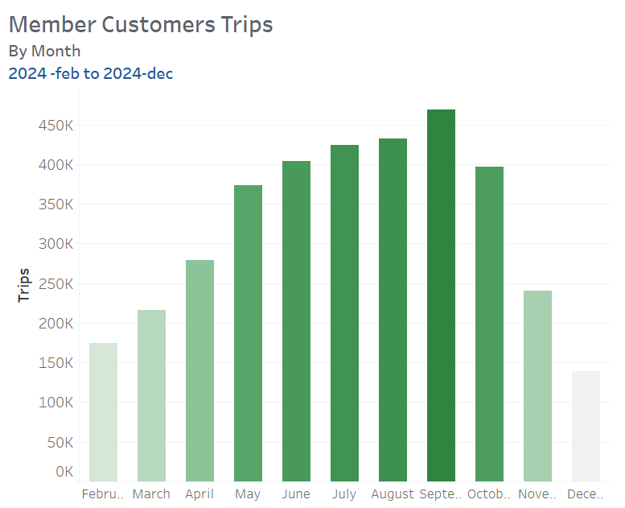
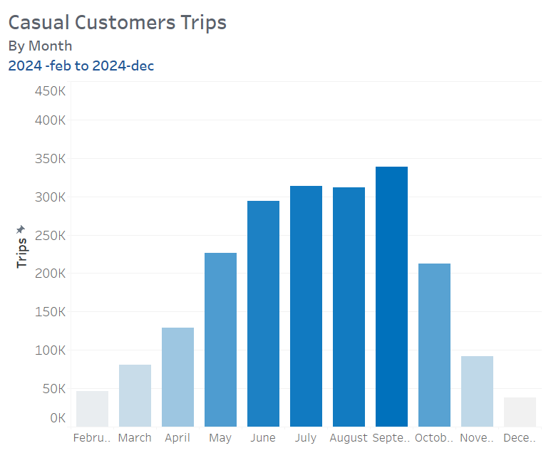

# Cyclistic Analysis Report
**By:** Roger Gomez

**Date:** April 4, 2025

**Project Context:**
This report analyze the data from Cyclistic dataset to get insights about the difference between **casual** and **member** customer.

## Introduction
This report analyzes the period time from 2024-Feb to 2025-Feb data from Bike-Share Company operating in Chicago. The primary objective of the analysis is to identify and understand the differences in riding behaviors between two distinct user groups: **members** and **casuals** riders.By examining key metrics such as total number of rides and bike type usage across both groups, this report aims to uncover patterns that can inform Cyclistic's marketing strategy. Understranding how each rider type intereacts with the service —such as their most-used bike types—can help Cyclistic make data-driven decision to increase annual memberships and improve user experience for both existing and potential customers.

## Analysis Process
Great! Let's begin with our analysing process. I've got a Cyclistic dataset from 2024-FEB to 2025-FEB.

### Trips Over The Time
Let's start to see the total trips that have been made by riders along that time.

---

```sql
      SELECT 
        COUNT(*) AS total_rides
      FROM Cyclistic_data ;
```
---
| Total Trips | 
|:-------------|
| 5,916,546 | 

---
In total, It have been done **5,916,546.** trips. Now, let's how many trips have been done per each category of customers.

---
```sql
    SELECT 
    member_casual,
    COUNT(ride_id) AS Trips
    FROM Cyclistic_data
    GROUP BY member_casual;
```
---
| Member_casual |Trips|
|:------------- |-----|
| member| 3,783,918|
|casual | 2,132,628|

---

It confirms that the **member customers** used to use the services more than **casual customers.**

Now, I'm interested to see the trends of the trips donde over the time (2024-feb to 2025 feb) by customer type.

---

```sql

    SELECT 
     DATENAME(YEAR, started_at) AS Year,
     DATENAME(MONTH, started_at) AS Month,
     member_casual,
     COUNT(ride_id) AS Trips,
    FROM Cyclistic_data
    WHERE member_casual = 'member',
    GROUP BY  DATENAME(YEAR, started_at), DATENAME(MONTH, started_at), member_casual
    ORDER BY MIN(started_at) ;
    
```

---

| Year | Month | member_casual | Trips |
|:---- |:-----:| :-----:      | ---:  |
| 2024 | February | member | 174,099 |
|2024| March | member | 216,204 |
|2024 | April | member | 279,176 |
|2024 | May | member | 373,137 | 
|2024 | June | member | 404349 |
|2024 | July | member | 424,115|
|2024 | August| member| 432,738 |
|2024 | September | member| 468,723|
|2024 | October | member | 396,517 |
|2024 | November | member| 240,070 |
|2024 | December | member| 138,630 |
|2025 | January | member | 113,256 |
|2025 | February| member | 122,904 |


---
Let's run the same query, just replacing 'member' to 'casual' in the WHERE clause.

---

| Year | Month | member_casual | Trips |
|:---- |:-----:| :-----:       | ---:
| 2024 | February | casual | 46,387|
|2024| March |casual | 81,089 |
|2024 | April | casual | 129,070 |
|2024 | May | casual | 226,033 | 
|2024 | June | casual | 293,953 |
|2024 | July | casual | 313,401|
|2024 | August| casual| 311,465 |
|2024 | September | casual| 338,869|
|2024 | October | casual | 212,376 |
|2024 | November |casual| 91,422 |
|2024 | December |casual| 37,693 |
|2025 | January | casual | 23,621 |
|2025 | February| casual |27,249 |

---

<table>
  <tr>
    <td>  </td>  
    <td>  </td>  
  </tr>
</table>
    
---

According to the results, in the **summer season** both groups used to make more trips than the other season. We probably say because the weather both group prefer go to their destination by riding our bikes/scooters than by walk.

In the other hand, we see that in the **winter season** both groups used to get the service less than the other season.That probably could be due the **weather** in this case the cold. People prefer for to their destinantion by taxi or something that help them to stay warm.

---

### Weather vs Number of Trips

Let's confirm whether there is a **correlation between the number of trips and the weather.

We are using the **Chicago dataset**, whic contains daily data on weather conditions and trips.

Now, we will use **R** to run the following code:

```r
library(ggplot2)
 library(scales)
    
    
   ggplot(data = chicago, aes(x = avg_temp, y = trips)) + 
   geom_point(color = \"blue\", size = 2, alpha = 0.7) + 
    "  geom_smooth(method = \"lm\", color = \"deepskyblue\", se = FALSE) + 
    "  scale_y_continuous(labels = scales::comma) + \n",
    "  labs(title = \"Relationship Between Temperature and Bike Trips\",
    "       x = \"Average Temperature (°C)\",\n",
    "       y = \"Number of Trips\") + \n",
    "  theme_minimal()


```
---

 <table><tr>
    <td>  </td>  
    </tr></table>
    
---

Indeed, there's a **positive correlations** between the weather and number of trips.

---


### Monthly Trips Average by Customer Type

Next, let's get the monthly average of number of trips that each groups have done along the period

---

```sql

WITH monthly AS (
    SELECT 
    DATENAME(YEAR, started_at) AS Year, 
    DATENAME(MONTH, started_at) AS Month,
    DATEPART(MONTH, started_at) AS Number,
    member_casual,
    COUNT(ride_id) AS Trips
    FROM Cyclistic_data
    WHERE member_casual = 'member'
    GROUP BY DATENAME(YEAR, started_at), DATENAME(MONTH, started_at), DATEPART(MONTH, started_at), member_casual
   )
   
    SELECT 
      Year,
     member_casual,
    AVG(Trips) AS Monthly_avg_trips
    FROM monthly
    GROUP BY Year, member_casual
    ORDER BY Year\n"

```
---
|Year| Member_casual |Avg.Trips|
|:--- |:-------------: |-----|
|2024| member | 322,523|
|2025|member  |118,080|

---
Let's run the same query, just replacing 'member' to 'casual' in the WHERE clause.

---

|Year| Member_casual |Avg.Trips|
|:---|:-------------: |-----|
|2024| casual | 189,250|
|2025| casual  |25,435|

---
In average, **member customers** made around 322,523 trips per month in 2024, while the **casual customers** made around 189,250 trips per month in the same year.

---

### Trips on Weekdays

Now, I'm interested in analyzing the trends in the number of trips for both groups on weekdays.

---

```sql
SELECT 
   DATEPART(WEEKDAY, started_at) AS Weekday_number,
   DATENAME(WEEKDAY, started_at) AS time,
   member_casual,
   COUNT(*) AS Trips
FROM Cyclistic_data
WHERE member_casual = 'member'
GROUP BY DATEPART(WEEKDAY, started_at) ,DATENAME(WEEKDAY, started_at), member_casual
ORDER BY weekday_number ;

```
---
 | Weekday_number | Day| member_casual | Trips |
 |:---- |:-----:| :-----:       | ---:
 | 1 | Sunday    | member | 424,408 |
 | 2 | Monday    | member | 543,185 |
 | 3 | Tuesday   | member | 582,982 |
 | 4 | Wednesday | member | 616,683 |
 | 5 | Thrusday  | member | 585,758 |
 | 6 | Friday    | member | 542,310 |
 | 7 | Saturday  | member | 488,592 |
 
---
Let's run the same query, just replacing 'member' to 'casual' in the WHERE clause.

---

| Weekday_number | Day| member_casual | Trips |
|:---- |:-----:| :-----:  |---:      | 
| 1 | Sunday    | casual | 365,220 |
| 2 | Monday    | casual | 250,501 |
| 3 | Tuesday   | casual | 231,145 |
| 4 | Wednesday | casual | 267,289 | 
| 5 | Thrusday  | casual | 263,788 |
| 6 | Friday    | casual | 314,667 |
| 7 | Saturday  | casual | 440,018 |

---

 <table><tr>
    <td>  </td>   
    <td>  </td>  
    </tr></table>
 
---

The results show that **member customers** tend to take more trips on **weekdays**, while  the **casual customers** take more trips on **weekend.**

It is likely that **members** use the bikes for commuting to work, whereas **casuals** use them for leisure activities

---

### Peak Hours by Trips

Now, let's analyze the peak hours when customers take the most trips

---

```sql 
    SELECT 
      TOP 6 
     FORMAT(started_at, 'h tt') AS Time
    member_casual
     COUNT(*) AS Trips
    FROM Cyclistic_data 
    WHERE member_casual = 'member'
    GROUP BY FORMAT(started_at, 'h tt'), member_casual
    ORDER BY Trips DESC ;

```
---

| Time | member_casual | Trips |
|:---- |  :-----:      | -----:     
|5 PM| member | 401,012 |
|4 PM| member | 351,662 |
|6 PM| member | 311,414 |,
|**8 AM**| **member** | **262,509** |
|3 PM| member | 257,062 |
|7 PM| member | 217,774 |

---

Let's run the same query, just replacing 'member' to 'casual' in the WHERE clause.

---

| Time | member_casual | Trips |
|:---- |  :-----:      | -----:   
|5 PM| casual | 202,697 |
|4 PM| casual | 190,257 |
|6 PM| casual | 171,840 |
|3 PM| casual | 168,895 |
|2 PM| casual | 153,354 |
|7 PM| casual | 147,139 |

---
<table><tr>
    <td>  </td>   
    <td>  </td> 
    </tr></table>
    
---
The results show that the busiest hours are in the evening. however, it caught my attention that **8 AM** also appears as a peak hour for **members**. This suggests that they likely use the service to commute to work or university.

---

### Most bike type used

Now, let's analyze which bike type was used the most during the period under review.

---

```sql 

SELECT
    trideable_type,
    COUNT (ride_id) AS Trips
    FROM Cyclistic_data
    GROUP BY  rideable_type
    ORDER BY Trips DESC ;

```

---

|rideable_type | Trips |
|:----         | -----:     
|electric_bike |  3,028,958 |
|classic_bike  | 2,747,222  |
|electric_scooter| 140,366|

---

The **Electric bike** is the most frequently used bike by customers over time. \Now, let's see if this changes when we calculate the most used bike for each customer group.

---

```sql
    SELECT 
    trideable_type,
    member_casual,
    COUNT (ride_id) AS Trips
    FROM Cyclistic_data
    WHERE member_casual = 'member'
    GROUP BY  rideable_type, member_casual
    ORDER BY Trips Desc ; 
    
```
---

|rideable_type   | member_casual| Trips  |
|:----           |   :-----:    |  -----:     
|electric_bike   | member       |1,949,920 |
|classic_bike    | member       | 1,776,736|
|electric_scooter| member       | 57,262   |

---

Let's run the same query, just replacing 'member' to 'casual' in the WHERE clause.

---

|rideable_type   | member_casual| Trips  |
|:----           |   :-----:    |  -----:     
|electric_bike   | casual       |1,079,038 |
|classic_bike    | casual       | 970,486  |
|electric_scooter| casual       | 83,104   |

---

 <table><tr>
    <td>  </td>   
    <td>  </td>  
    </tr></table>

---

According to the results, both groups use the same type of bikes. However, the only difference between them is that **casual customers** use the **electric scooter** more frequently than **members**.

---

### Trips Avg. Duration.

Now, let's analyze the duration (on avg.minutes) that customers use each type of bike.

---

```sql
    SELECT 
     rideable_type,
     member_casual,
    AVG(minutes_traveled)  AS avg_minutes_traveled,
    FROM Cyclistic_data
    WHERE member_casual = 'member'
    GROUP BY rideable_type, member_casual
    ORDER BY avg_minutes_traveled  DESC;
```
---

|rideable_type   | member_casual| avg_minutes_traveled |
|:----           |   :-----:    |  -----:      
|classic_bike   | member       |   13     |
|electric_bike  | member       |   11     |
|electric_scooter| member      |    8     |

---
Let's run the same query, just replacing 'member' to 'casual' in the WHERE clause.

---

|rideable_type   | member_casual| avg_minutes_traveled |
:----           |   :-----:    |  -----:      
|classic_bike    | casual       |   29    |
|electric_bike   | casual       |   14    |
|electric_scooter| casual       |    12   |

---

 <table><tr>
    <td>  </td>  
    <td>  </td>  
    </tr></table>
    
---

According to the results, the **casual customers** spend more time riding the bikes than the **member customers.**

Since we know that the casual customer spend more time riding the bikes, it would be interesing to determine which days they tend to spend the most time on the bikes.

---

```sql
    SELECT 
    TOP 2
    DATENAME(WEEKDAY, started_at) AS Day,
    rideable_type,
    member_casual,
    AVG(minutes_traveled)  AS avg_minutes_traveled 
    FROM Cyclistic_data
   WHERE member_casual = 'member'
   GROUP BY rideable_type, member_casual, DATENAME(WEEKDAY, started_at)
   ORDER BY avg_minutes_traveled  DESC;
```

---

|  Day   |rideable_type   | member_casual| avg_minutes_traveled |
| :----  | :------:       |   :-----:    |    -----:            |
|Saturday| classic_bike   |   member     | 14 |
|Sunday  | classic_bike   |   member     | 14 |

---

Let's run the same query, just replacing 'member' to 'casual' in the WHERE clause.

---

|  Day   |rideable_type   | member_casual| avg_minutes_traveled |
| :----  | :------:       |   :-----:    |    -----:            |
|**Sunday**| **classic_bike**   |   **casual**     | **32** |,
|**Saturday**| **classic_bike**   |   **casual**     | **31** |

---

The results show that both groups spend more time traveling on the bikes during the weekends.However, **casual customers spend twice as much time as member customers.**

---

### Distance Traveled by Customer Type (Miles)

Now, let's analyze the distance each customer type has traveled, measured in avg. miles.

```sql
    SELECT
     rideable_type,
     member_casual,
    ROUND(AVG(distance_meters)/60,2) AS avg_miles_traveled
    FROM Cyclistic_data
    WHERE member_casual = 'member'
    GROUP BY rideable_type, member_casual
    ORDER BY avg_miles_traveled  DESC;
    
 ```
 ---
 
 |rideable_type   | member_casual| avg_miles_traveled |
 |:----           |   :-----:    |  -----:      
 |electric_bike   | member       |   40.47   |
 |classic_bike    | member       |   32.26   |
 |electric_scooter| member       |   26.07   |
 
 
 
---

Let's run the same query, just replacing 'member' to 'casual' in the WHERE clause.

---

|rideable_type   | member_casual| avg_miles_traveled |
|:----           |   :-----:    |  -----:      
|electric_bike   | casual      |   37.27  |
|classic_bike    | casual      |   34.84  |
|electric_scooter| casual      |   23.98  |


---

According to the results, when we focus on the **classic bike**, we can see that **casual customers**, on average, have traveled more miles than **member customers.**

---

### Most Popular Starting Stations

Now, let's analyze the most popular starting stations based on the number of trips.

---
```sql
    SELECT 
    TOP 5
     start_station_name,
     member_casual,
    COUNT(ride_id) AS Starting_trips
    FROM Cyclistic_data
    WHERE member_casual = 'member' AND start_station_name IS NOT NULL
    GROUP BY start_station_name, member_casual
    ORDER BY Starting_trips  DESC;

```
---

|start_station_name             | member_casual| Starting_trips |
|:----                          |   :-----:    |  -----:      
|Kingsbury St & Kinzie St       | member       |   31,107  |
|Clinton St & Washington Blvd   | member       |   28,564  |
|Clinton St & Madison St        | member       |   25,676  |
|Clark St & Elm St              | member       |   25,455  |
|Wells St & Concord Ln          | member       |   21,251  |

---

Let's run the same query, just replacing 'member' to 'casual' in the WHERE clause.

---

|start_station_name             | member_casual| Starting_trips |
|:----                          |   :-----:    |  -----:      
|Streeter Dr & Grand Ave              | casual      |  50,778   |
|DuSable Lake Shore Dr & Monroe St    | casual      |  33,956   |
|Michigan Ave & Oak St                | casual      |  24,996   |
|DuSable Lake Shore Dr & North Blvd   | casual      |  22,855   |
|Millennium Park                      |casual       |  22,454   |

---
According to the results, we can see that the most common starting stations for **member customers** are in **urban zone**, while the most common starting stations for the **casual** customers are in **recreational zone.**

---

### Distance Traveled in Categories

 I want to calculate the duration of trips for both groups. Let's classify the trips into three categories: 
 
 **Short:** Trips that are less than or equal to 1 mile (or 1,000 meters). 
 **Medium:** Trips between 1 and 2 miles.
 **Long**: Trips that are greater than 2 miles.
 
 ----
 
 ```sql

  WITH trip_category AS (
     SELECT 
      member_casual,
     distance_meters,
        CASE 
            WHEN distance_meters <= 1000 THEN 'short_trip'
            WHEN distance_meters > 1000 AND distance_meters <= 2000 THEN 'medium_trip'
            ELSE 'long_trip'
            END AS trip_category
       FROM Cyclistic_data
    )
    
    SELECT 
     member_casual,
     trip_category,
    CONCAT(CAST(ROUND(COUNT(*) * 100.0 / SUM(COUNT(*)) OVER(PARTITION BY member_casual), 0) AS INT), '%') AS trip_category_percentage
    FROM trip_category
    WHERE member_casual = 'member'
    GROUP BY member_casual, trip_category
    ORDER BY trip_category_percentage DESC ;
 
 ```
 ---
 
 |member_casual   | trip_category| avg_miles_traveled |
 |:----           |   :-----:    |  -----:      
 |member          | long_trip    |   39%     |
 |member          | medium_trip  |   32%     |
 |member          | short_trip   |   29%     |
 
 ---
 
 Let's run the same query, just replacing 'member' to 'casual' in the WHERE clause.
 
 ---
 
 |member_casual   | trip_category| avg_miles_traveled |
 |:----           |   :-----:    |  -----:      
 |member          | long_trip    |   40%     |
 |member          | medium_trip  |   33%     |
 |member          | short_trip   |   28%     |
 
 ---
 
 According to the results, in average both groups use the bike to make trips longer than 2 miles. 
 
 ---
 
 ###  Percentage Representacion by Bikes Type
 
 Now, let's analyze the percentage representation of each bike type in those trips.
 
 ---
 
 ```sql
   WITH trip_category AS (
      SELECT 
            trideable_type,
            member_casual,
            distance_meters,
            CASE 
               WHEN distance_meters <= 1000 THEN 'short_trip'
                WHEN distance_meters > 1000 AND distance_meters <= 2000 THEN 'medium_trip'
                ELSE 'long_trip'
           END AS trip_category
        FROM Cyclistic_data
    )

    SELECT 
         trideable_type,
         member_casual,
         trip_category,
         CONCAT(CAST(ROUND(COUNT(*) * 100.0 / SUM(COUNT(*)) OVER(PARTITION BY member_casual), 0) AS INT), '%') AS trip_category_percentage
    FROM trip_category
    WHERE member_casual = 'member' AND trip_category = 'long_trip'
    GROUP BY member_casual, trip_category, rideable_type
    ORDER BY trip_category_percentage DESC ;
```
 ---
 
 |ridealbe_type   |member_casual | trip_category| trip_category_percentage |
 |:----           |   :-----:    |  -----:      |      -----:              |
 |electric_bike   | member       |   long_trip  |     60%                  |
 |classic_bike    | member       |   long_trip  |      39%                 |
 |electric_scooter| member       |  long_trip   |      1%                  |
 
 ---
 Let's run the same query, just replacing 'member' to 'casual' in the WHERE clause.
 
 ---
 
 |ridealbe_type   |member_casual | trip_category| trip_category_percentage |
 |:----           |   :-----:    |  -----:      |      -----:              |
 |electric_bike   | casual       |   long_trip  |     54%                  |
 |classic_bike    | casual       |   long_trip  |      44%                 |
 |electric_scooter| casual       |  long_trip   |      2%                  |
 
 ---
 
 In fact, the results show that **casual customers** use **classic bike** more frequently for their long trip. 
 
---

## Conclusion

Overall, demand from member customers tends to be more stable throughout the year. Both rider groups reach peak usage during the summer months and experience the lowest demand in winter, showing a positive correlation between weather and ride volume. This seasonal trend is likely due to colder temperatures discouraging bike usage in favor of warmer transportation options. On average, members took more trips per month than casual riders during the period analyzed.

When examining weekly patterns, casual riders are more likely to use bikes on weekends, suggesting recreational usage, while members tend to ride more during weekdays, likely commuting to work or university. This is further supported by hourly trends: members often ride around 8:00 AM and again in the evening, aligning with typical work or school hours. In contrast, casual riders show low usage in the morning and peak activity in the evening, which may reflect leisure activities after work or school hours.
 
Electric bikes were the most commonly used bike type across both groups, possibly indicating a shared preference for speed and convenience. Interestingly, even though electric bikes are faster, both groups spend more time on classic bikes—with casual riders spending twice as much time on average compared to members.Another notable difference is in trip start locations. Casual riders often begin their trips in recreational areas such as parks or near museums, while member trips tend to start in urban zones, reinforcing the assumption that members use the service primarily for commuting. Lastly, both rider groups frequently use electric bikes for trips longer than 2 miles, indicating their suitability for longer distances.

## Recomendations

Based on the findings from the analysis, the following strategies could be implemented to encourage casual riders to convert into annual members:

- **Seasonal Membership Promotions:** Given that the summer season sees the highest demand for bikes, offering seasonal discounts or promotions for new members during this peak period could attract casual riders to commit to a membership.

- **Electric Bike Discounts for Members:** Since electric bikes are the preferred choice for both member and casual riders, offering discounted rates or exclusive access to electric bikes for members could be an effective way to incentivize casual riders to become members.

- **Ride-Time Based Discounts for Classic Bikes:** Casual riders, on average, spend more time traveling on classic bikes (approximately 32 minutes per ride). Implementing a discount system based on the duration of rides, such as offering a discount for every 10 minutes of travel, could provide an additional incentive for casual riders to consider a membership, while also rewarding their extended use of the classic bikes.


 

 


 


